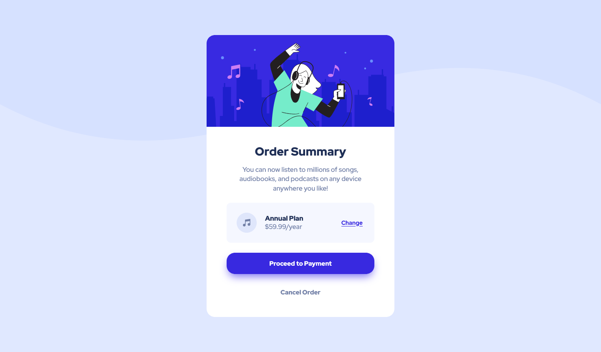

# Frontend Mentor - Order summary card solution

This is a solution to the [Order summary card challenge on Frontend Mentor](https://www.frontendmentor.io/challenges/order-summary-component-QlPmajDUj). Frontend Mentor challenges help you improve your coding skills by building realistic projects. 

### Screenshot 

### Links

- [Soulution](https://github.com/bjoerndeppisch/fem-order-summary-component)
- [Live Site](https://bjoerndeppisch-fem-order-summary.netlify.app/)

### Built with

- Semantic HTML5 markup
- CSS Custom Properties
- Flexbox
- Sass
- BEM Naming
- Fluid Sizing
- Media Queries

### Tools
- [Clamp Calculator for linear scaling](https://royalfig.github.io/fluid-typography-calculator/) [Viewport Range: 375px - 1440px]

## Author

- Frontend Mentor - [@bjoerndeppisch](https://www.frontendmentor.io/profile/bjoerndeppisch)
- Twitter - [@bjoerndeppisch](https://twitter.com/bjoerndeppisch)
